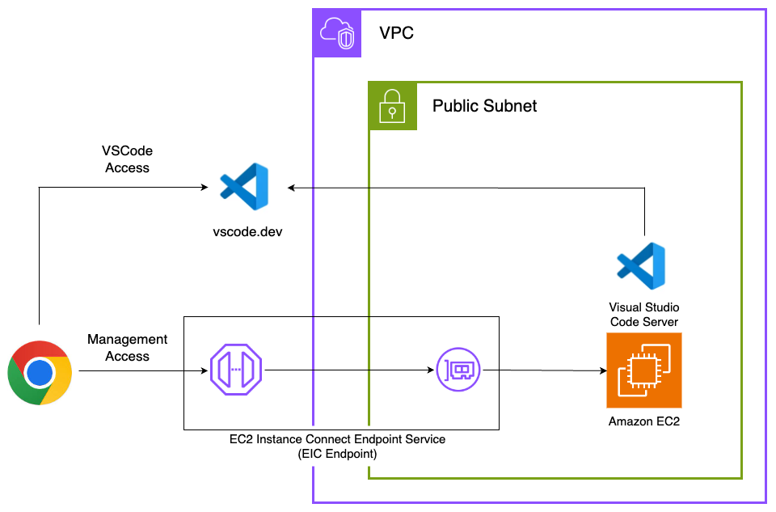

# CDK VSCode Server Construct

This is a CDK Construct for creating a VSCode server on an Amazon Linux EC2 instance.

You can access to Visual Studio Code server by browser and start development easily.

[](https://constructs.dev/packages/cdk-code-server)

[](https://open.vscode.dev/badmintoncryer/cdk-code-server)
[](https://badge.fury.io/js/cdk-code-server)
[](https://github.com/badmintoncryer/cdk-code-server/actions/workflows/build.yml)
[](https://github.com/badmintoncryer/cdk-code-server/actions/workflows/release.yml)
[](https://opensource.org/licenses/Apache-2.0)
[](https://www.npmjs.com/package/cdk-code-server)



## Usage

Install the package:

```bash
npm install cdk-code-server
```

Use it in your CDK stack:

```typescript
import { CodeServer } from 'cdk-code-server';

new CodeServer(this, 'CodeServer');
```

You can customize the instance type, node.js version, and other properties:

```typescript
import { CodeServer } from 'cdk-code-server';
import * as ec2 from 'aws-cdk-lib/aws-ec2';

// Use an existing VPC
declare const vpc: ec2.IVpc;
// Use an existing policy as a instance role
declare const policy: iam.PolicyStatememnt;

new CodeServer(this, 'CodeServer', {
  vpc,
  // Specify the instance type
  // Default is c7g.2xlarge
  instanceType: ec2.InstanceType.of(ec2.InstanceClass.T3, ec2.InstanceSize.MEDIUM),
  // Specify the CPU architecture
  // Default is ec2.AmazonLinuxCpuType.ARM_64
  cpuType: ec2.AmazonLinuxCpuType.X86_64,
  // Specify the IAM policy for the instance role
  // Default is a policy that has an administrator access
  policy,
  // Specify the size of the EBS volume
  // Default is 30 GB
  volumeSize: 100,
});
```

## Setup VSCode Server

After the stack is deployed, you can access to the server via EC2 instance connect endpoint(EIC endpoint) and create connection to the VSCode server:

### Access to the EC2 instance

Access the EC2 management console in the AWS Console, and connect to your EC2 instance via the EIC Endpoint.

Select the Instance ID > Connect > EC2 Instance Connect > Connect using EC2 Instance Connect Endpoint > Connect

If the following screen is displayed, you're all set.


### Start the VSCode server

Execute the following command to start the VSCode server:

```sh
[ec2-user@ip-10-0-0-23 ~]$ code tunnel service install
[2024-06-10 02:10:42] info Using GitHub for authentication, run `code tunnel user login --provider <provider>` option to change this.
To grant access to the server, please log into https://github.com/login/device and use code 3811-9932
```

Next, open your browser and go to <https://github.com/login/device>, enter the code, and complete the authentication.

In the example above, enter '3811-9932' > Continue > Continue > Authorize-Visual-Studio-Code.

Return to the EC2 instance, run the code tunnel again, and open the displayed URL <https://vscode.dev/tunnel/ip-{privateIp}{region}> in your browser.

```sh
[ec2-user@ip-10-0-0-23 ~]$ code tunnel
*
* Visual Studio Code Server
*
* By using the software, you agree to
* the Visual Studio Code Server License Terms (https://aka.ms/vscode-server-license) and
* the Microsoft Privacy Statement (https://privacy.microsoft.com/en-US/privacystatement).
*
[2024-06-10 02:11:44] info Creating tunnel with the name: ip-10-0-0-23ap-north
[2024-06-10 02:11:44] info Open this link in your browser https://vscode.dev/tunnel/ip-10-0-0-23ap-north

Connected to an existing tunnel process running on this machine.

Open this link in your browser https://vscode.dev/tunnel/ip-10-0-0-23ap-north
```

VSCode will open, and you'll be prompted with "What type of account did you use to start this tunnel?" Select `GitHub`.

At this point, the GitHub authentication screen may appear again, so press Authorize.

Once you open the terminal, you’re all set.


